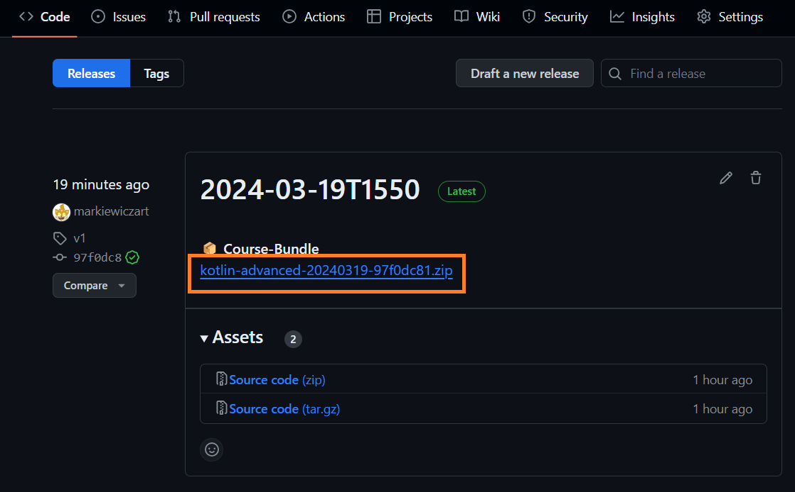
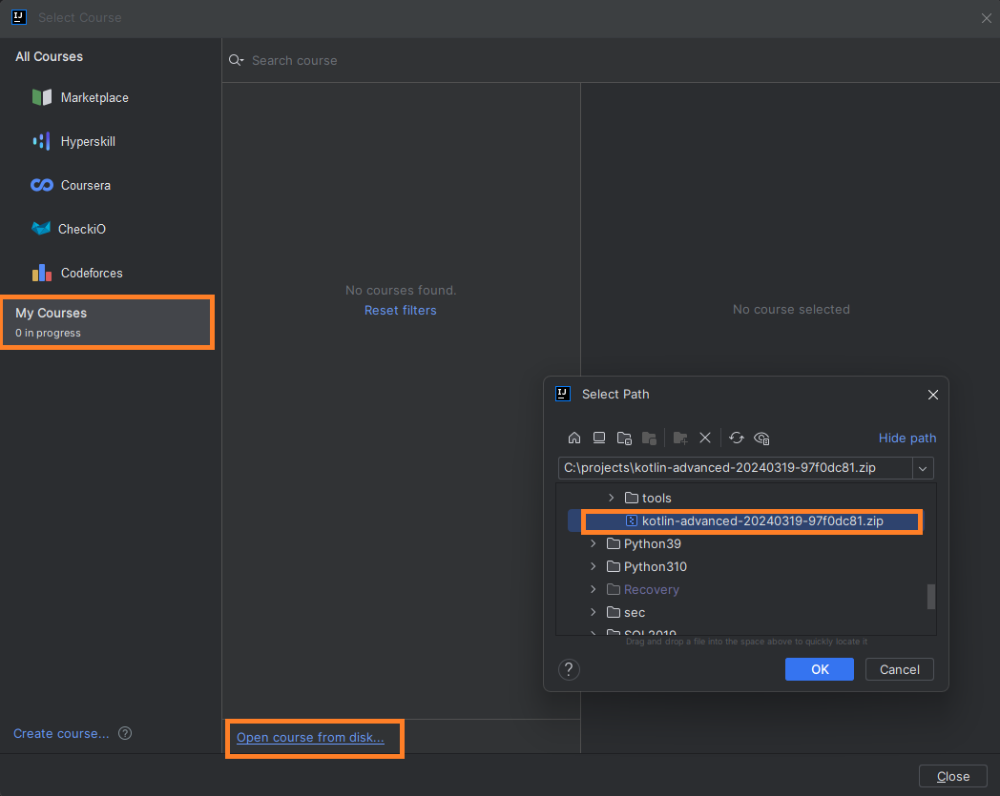

# Kotlin Advanced
Welcome to the Kotlin Advanced training!

## Getting started
### Requirements
The training uses IntelliJ with JetBrains Academy plugin. Before starting, please make sure that:
* You have a recent version of [IntelliJ](https://www.jetbrains.com/idea/download) (community version is fine).
* [JetBrains Academy plugin](https://plugins.jetbrains.com/plugin/10081-jetbrains-academy) is installed. If not,
go to File → Settings → Plugins → Marketplace and search for "JetBrains Academy". 
* You have Java 8+, Java 17 is recommended.

### Download the course
The training is distributed as a ZIP file, that contains all the course contents. Please download the latest
course bundle from the [GitHub releases](https://github.com/iteratec/kotlin-training-advanced/releases) page.

### Open the course
You can open the downloaded course bundle via JetBrains Academy plugin. Please follow these steps:
1. Open the menu _File → Learn and Teach → Browse courses_.
2. Select _My courses_ (left panel).
3. Select _Open course from disk..._ (link in the bottom of the middle panel).
4. Select the downloaded ZIP file.
5. Click the _Start_ button in the popup. You may also expand the _Settings_ section and select the JDK used for the course.
6. The course should open and start the initialization (it may take a while).

